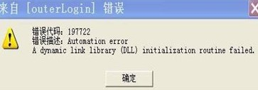
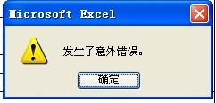
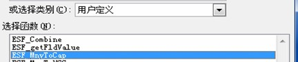
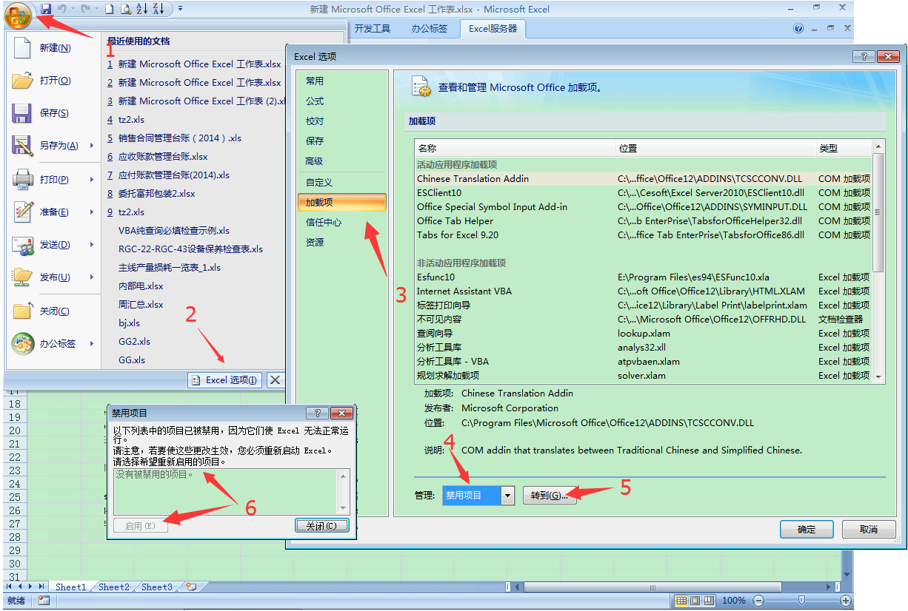
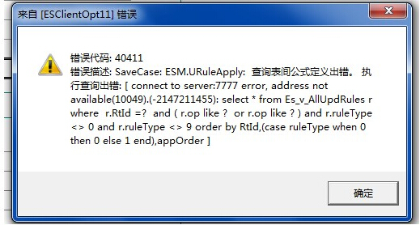
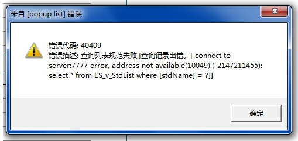

# 1.3 ES常见问题汇总

## 1. 196790错误
    
装了勤哲无法识别的WPS

## 2. 197722错误
  
解决方法1：卸载，重新安装，用管理员身份
解决方法2：在系统环境变量中添加ES安装路径如：C:\Program Files (x86)\Cesoft\Excel Server2010

## 3. 70错误
  
win7安装勤哲时右击以管理员权限运行
> ES很依赖管理员，安装如此，运行也如此

## 4. 53错误

  
2013版本:360禁用了某些组件，360弹出的时候点同意就行了。
> 真爱生命，远离360	

## 5. 40402错误
  
直接调数据库大小，win2003要装sql2000企业版,装个人版数据库大小不可调

## 6. 勤哲端口
|端口|类型|
|:----|:--:|
|7777      |软件|  
|7778,7779 |网盘|
|80        |web|

## 7. win2003iis开了后自动关闭.
点击“开始”-“控制面板”-“管理工具”-“组件服务”-“计算机”-“我的电脑”-“DCOM”选项， 选择其下的“IIS ADMIN SERVICE”，右健选择“属性”，找到“安全”，在“启动和激活权限”中编辑“自定义”，添加帐号“NETWORK SERVICE ”

## 8. 忘记系统管理台密码了
  
进数据库ESsystem,找到表SysInfo里的sysPwd删了，然后登陆，系统会提示没密码

## 9. 图片发生意外错误
  
Internet选项-程序-设为默认值

## 10. 勤哲自带人民币大写函数丢失（ESF_MnvToCape）
  
此函数容易丢失，所以用excel自带的函数(web客户端没有测)：
	=IF(O18<0,"负","")&SUBSTITUTE(SUBSTITUTE(TEXT(TRUNC(FIXED(ABS(O18))),"[>0][dbnum2];;")&IF(INT(O18),"元",)&TEXT(RIGHT(FIXED(O18),2),"[dbnum2]0角0分;;"&IF(ABS(O18)>1%,"整",)),"零角",IF(ABS(O18)<1,,"零")),"零分","整")
> 拼音等函数也一样，能不用自带最好不用

## 11. XP是中文，win7中是英文
需修改wsweb文件夹下的webconfig.ini,将value="en-us"改为value="zh-cn"

## 12. 登录勤哲闪退，秒退
在excel里的禁用里把esclient10.dll启用就行了。  
2007版以上：  


## 13. Excel模版公式值变成数值1，公式失效。
  
9.2.335出现过，解决方法1：设计模版的时候不点保存，而是点关闭，弹出保存的时候再保存。这样公式就不会变成1了

## 14. win7X64位,web客户端填报卡在那不动了


## 15. 429错误(未完全解决)
  
- 解决方法1：运行	`regsvr32 scrrun.dll`
- 解决方法2：运行	`regsvr32 "C:\Program Files\Common Files\System\ado\msado15.dll"`
- 解决方法3：如果上述两法仍未解决，则可能是其它原因，不仿试试下面bat批处理代码。  
将下面代码复制到记事本，另存为 cmd.bat，双击运行就可以了。  
```sh
echo 正在修复，这个过程可能需要几分钟，请稍候……
rundll32.exe advpack.dll /DelNodeRunDLL32 %systemroot%\System32\dacui.dll
rundll32.exe advpack.dll /DelNodeRunDLL32 %systemroot%\Catroot\icatalog.mdb
regsvr32 /s comcat.dll
regsvr32 /s asctrls.ocx
regsvr32 /s oleaut32.dll
regsvr32 /s shdocvw.dll /I
regsvr32 /s shdocvw.dll
regsvr32 /s browseui.dll
regsvr32 /s browseui.dll /I
regsvr32 /s msrating.dll
regsvr32 /s mlang.dll
regsvr32 /s hlink.dll
regsvr32 /s mshtml.dll
regsvr32 /s mshtmled.dll
regsvr32 /s urlmon.dll
regsvr32 /s plugin.ocx
regsvr32 /s sendmail.dll
regsvr32 /s mshtml.dll /i
regsvr32 /s scrobj.dll
regsvr32 /s corpol.dll
regsvr32 /s jscript.dll
regsvr32 /s msxml.dll
regsvr32 /s imgutil.dll
regsvr32 /s cryptext.dll
regsvr32 /s inseng.dll
regsvr32 /s iesetup.dll /i
regsvr32 /s cryptdlg.dll
regsvr32 /s actxprxy.dll
regsvr32 /s dispex.dll
regsvr32 /s occache.dll
regsvr32 /s iepeers.dll
regsvr32 /s urlmon.dll /i
regsvr32 /s cdfview.dll
regsvr32 /s webcheck.dll
regsvr32 /s mobsync.dll
regsvr32 /s pngfilt.dll
regsvr32 /s licmgr10.dll
regsvr32 /s hhctrl.ocx
regsvr32 /s inetcfg.dll
regsvr32 /s trialoc.dll
regsvr32 /s tdc.ocx
regsvr32 /s MSR2C.DLL
regsvr32 /s msident.dll
regsvr32 /s msieftp.dll
regsvr32 /s xmsconf.ocx
regsvr32 /s ils.dll
regsvr32 /s msoeacct.dll
regsvr32 /s wab32.dll
regsvr32 /s wabimp.dll
regsvr32 /s wabfind.dll
regsvr32 /s oemiglib.dll
regsvr32 /s directdb.dll
regsvr32 /s inetcomm.dll
regsvr32 /s msoe.dll
regsvr32 /s oeimport.dll
regsvr32 /s msdxm.ocx
regsvr32 /s dxmasf.dll
regsvr32 /s laprxy.dll
regsvr32 /s l3codecx.ax
regsvr32 /s acelpdec.ax
regsvr32 /s mpg4ds32.ax
regsvr32 /s danim.dll
regsvr32 /s Daxctle.ocx
regsvr32 /s lmrt.dll
regsvr32 /s datime.dll
regsvr32 /s dxtrans.dll
regsvr32 /s dxtmsft.dll
regsvr32 /s wshom.ocx
regsvr32 /s wshext.dll
regsvr32 /s vbscript.dll
regsvr32 /s scrrun.dll mstinit.exe /setup
regsvr32 /s msnsspc.dll /SspcCreateSspiReg
regsvr32 /s msapsspc.dll /SspcCreateSspiReg
regsvr32 %WINDIR%\system32\msxml3.dll
echo.
echo.
echo 修复成功！任意键退出！
pause>nul
```

- 解决方法4:  
控制面板->管理工具->组件服务->计算机->我的电脑->DCOM配置  
找到Microsoft Excel 应用程序，右键它选择属性，然后查看一下安全选项卡，看一下是不中有权限进行“启动和激活权限”，“访问权限”，“配置权限”等，如果没有开放相应权限试试。

15. 工作台假死、无响应
登录后，工作台假死，无法操作系统  
（1）停掉客户机上的ESIMC.exe 进程  
（2）假如停掉ESIMC就没问题了，去到系统管理台上，勾掉开启消息提醒，重启服务，如果再没问题了，就可以确定是消息提醒的问题  
（3）用select * from es_imq，在essystem下执行  

## 16. 自动编号对应的SQL2000表
  

## 17. 自定义查询不预警
第一次设置，要停服务，重起，就会有预警了

## 18. 326错误填报附件时报错

  
winxp  +sql2000sp4
 
## 19. Sql2000版本
## 查询分析器方法
### 方法一 
第一步：在查询分析器中
```sql
select @@version
print @@version
```
执行，得到下面的信息
```sh
Microsoft SQL Server 2000 - 8.00.2039 (Intel X86) 
May 3 2005 23:18:38 
Copyright (c) 1988-2003 Microsoft Corporation 
Personal Edition on Windows NT 5.1 (Build 2600: Service Pack 2) 
```
另：在查询分析器中
```sql
SELECT SERVERPROPERTY('productversion'), SERVERPROPERTY ('productlevel'), SERVERPROPERTY ('edition')
```
运行结果如下： 
• 产品版本（例如，8.00.534）   
• 产品级别（例如，“RTM”或“SP2”）   
• 版本（例如，“Standard Edition”）。  
例如，运行结果可能类似于如下内容：  
```sh
8.00.534 SP2 Standard Edition
```
* 微软官方提供方法详见：http://support.microsoft.com/kb/321185/zh-cn 

### 方法二
企业管理器信息：  
打开企业管理器－>SQL SERVRE 组－>(local)window NT ->属性  
产品:有personal的是个人版的，有Enterprise的是企业版的  
产品版本：8.00.2039(sp4);  

### 方法三
软件版本：  
C:\Program Files\Microsoft SQL Server\MSSQL\Binn\sqlservr.exe   
点击鼠标右键查看版本也能得到，不过信息比较简单而已。8.00.2039就代表安装的SQL Server的版本了。  
SQL SERVER打补丁后的版本号Version Number Service Pack

	8.00.194 Microsoft SQL Server 2000
	8.00.384 Microsoft SQL Server 2000 SP1
	8.00.532 Microsoft SQL Server 2000 SP2
	8.00.760 Microsoft SQL Server 2000 SP3
	8.00.818 Microsoft SQL Server 2000 SP3 w/ Cumulative Patch MS03-031
	8.00.2039 Microsoft SQL Server 2000 SP4

## 20. 在管理工作表里设置分类显示，但在我的工作台不分类显示
  
sql2000升级sp4后解决。
刚开始数据库很小的时候不会出现这个问题，当数据库达到20G以上就有可能出现这个问题。

## 21. 1053错误(未找到方法)


## 22. sqlserver日志清理
用trunc.exe清理
>  也可到SQL里压缩日志

## 23. 改es默认端口


## 24. 40411/40409错误

  
填的了时候网络中断，再联上是可以保存报表的，但是如果换网络，就要重新登录

## 25. es2013.10.399工作流预警不提示(未解决)

## 26. win2008R2工作流待办预警在服务器上提示，在客户端上不提示(未解决)

## 27. 邮件设置，用qq邮箱时断时通(未解决)
推荐用263的邮箱作为服务邮箱。
> QQ等免费邮箱容易被反垃圾策略阻挡，建议用企业邮箱

## 28. es不支持excel2013X64位(未解决)
装X32位.

## 29. ES装win2008R2+SQl2008R2卡顿
登录有4-5秒的卡，登录成功后点模版开始卡，后来不卡。  
装Sql2008R2时只勾选需要安装的部分。
> 确切的说，安装“数据库引擎+管理工具”即可，其他SDK等一般人用不到

## 30. ES2013.10.399装win2012+SQl2012退出系统时卡顿(未解决)
退出系统时有2-3秒的假死。

## 31. ES+WPS兼容性不好
WPS和excel并存。  
先安装excel+es,再装wps，提示wps为主要打开软件时取消勾选。

## 32 web字段完整显示  
  
修改配置文件  
  

## 32 定时任务各种启动不了？
> @毛毛
> 服务器要装iis，否则定时任务确实会启动不了，而且经常发神经，不正常
> 要想正常，使用 sql server 代理

> @不笨的猪♂
> 定时任务 模板要勾选支持web

定时任务例如自动邮件等容易内存泄漏，建议经常重启ES服务，例如每周末4点重启一次。

## 本节贡献者
*@张PM*  
*@kangroo*  
*@毛毛*  
*@不笨的猪♂*

## links
  * [目录](<preface.md>)
  * 上一节: [上一节](<01.02.md>)
  * 下一节: [下一节](<01.04.md>)
