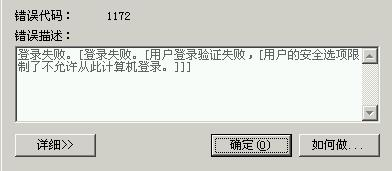

# 1.4 ES花式玩法技巧汇总

## ES登陆界面不保存用户名
 

## 冻结ES账号方法
高级版本有账号锁定和解锁，这里针对较低版本  
当一个ES账号因为某些原因需要冻结，可参考： 
1. 设置IP限制，使之无法登陆  
  
 
  
2. 修改系统表ES_USER中相应  

## 夹杂日期和日期+时间的时间段筛选 

## 临时屏蔽某表间公式的技巧
调试表间公式时，有时需要让某些表间公式失效，如果不想删除的话，可以参考：  
1. 如果是提数公式，可以设置表间公式为手动模式
2. 让公式失效，更绝对有效的方式是在筛选条件(或执行条件)前加入“1=2 并且 ”
3. 同样的,想让该表间公式绝对执行，可以在筛选条件中加入“1=1 或者 ”  
*注意: 2、3方案对回写公式也同样有效。*

## 替换ES主页示例
下载示例的H5页面，放在ESWEB目录下，代替index.aspx(原页面改名或移除)

地址[请右键另存](docs/index.htm)

## 清理工作流方案汇总
清理工作流主要是干掉WI表中的记录，

1. 如果模板以后不跑工作流了，在设计模板时点击【清理工作流】就行了

2. 如果是批量清除历史工作流记录，可以参考第三弹：http://iesap.net/wp-content/uploads/2015/07/ESAP3.pdf

3. 如何单独清除某个模板的历史工作流记录，很简单，参考以下步骤：
  1. 导出该模板的同时勾选导出数据;
  2. 删除该模板数据
  3. 导入模板并导入数据。

## 把已有模板的数据映射到一起
有些筒子早期设计的数据库不规范，造成后期拓展和查询十分困难，  
例如采购入库单，生产入库单本可以把数据表映射到一起。  
但是如果已经分成两个表了，如何映射到一起呢？  
参考方案：  
 1. 另建一个测试库
 2. 导出主库《生产入库单》+数据，删除主库《生产入库单》单模板
 3. 在测试库中导入《生产入库单》+数据
 4. 设计《生产入库单》，把表名改成与《采购入库单》的表名一样，相同字段名也要对应
 5. 导出测试库中改过的《生产入库单>+数据
 6. 导回到主库中
 7. 见证奇迹的时刻——完成映射！

## links
  * [目录](<preface.md>)
  * 上一节: [上一节](<01.03.md>)
  * 下一节: [下一节](<01.05.md>)
