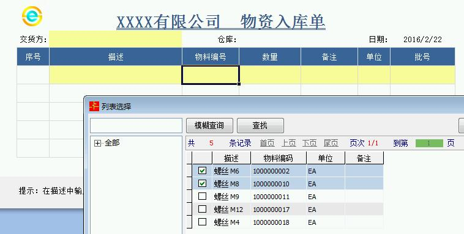
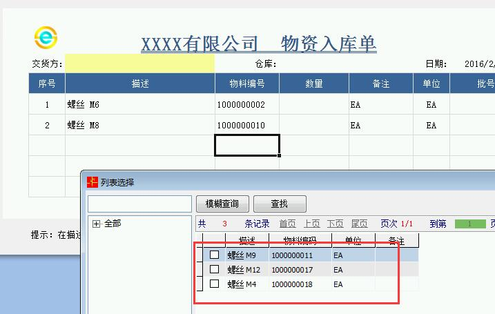
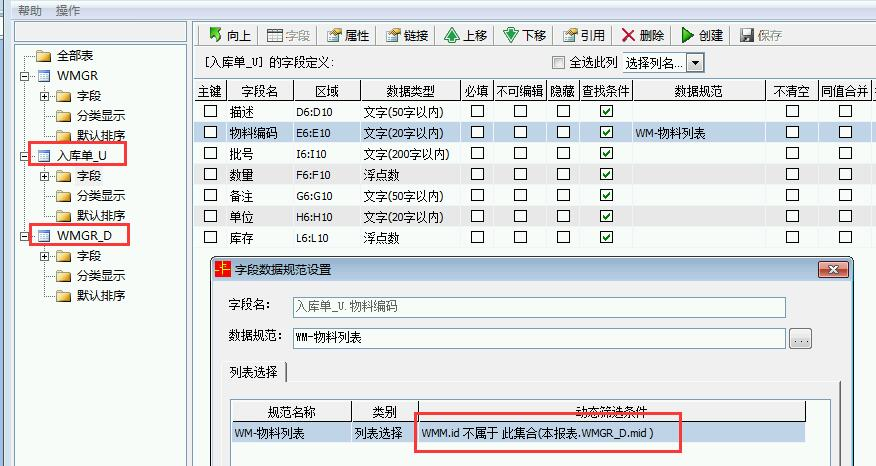

# 1.10 实现ES列表选择不重复
需求：通过ES列表选取内容后，下次再选择时过滤掉已选择的项目。

示例如下，第一次选择了
  
  
原理：   
1. 使用UD表技术，即定义一个明细U表叠放在明细D表上，并且不创建数据库。
2. 使用 *“不属于”* 函数实现过滤。  
 

示例ES模板下载：

地址[导入时勾选"同时导入数据"](files/1.10.rar)

## 延伸阅读
示例为9.4.124下的方案，事实上，经过村长提交需求后，高级版已经有新设置项，筛选条件可勾选行匹配，也就是说不再需要定义辅助明细表了。

## links
  * [目录](<preface.md>)
  * 上一节: [上一节](<01.9.md>)
  * 下一节: [下一节](<02.0.md>)
