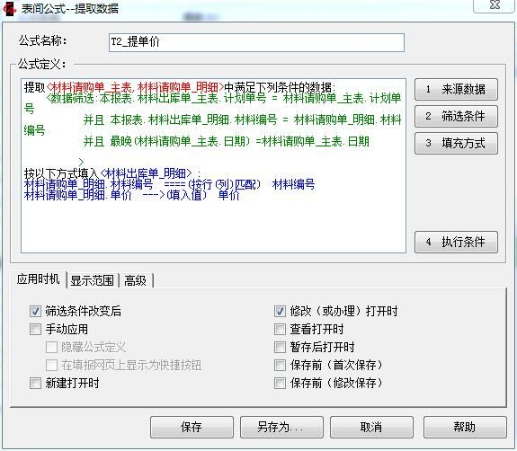
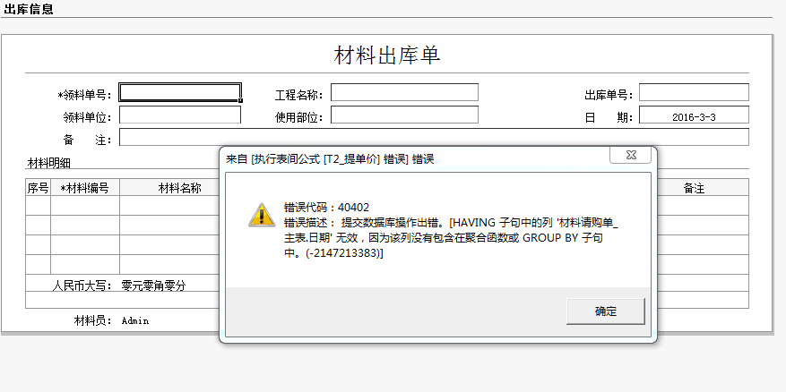

# 1.4 ES花式技巧汇总

## 1.ES登陆界面不保存用户名
 

## 2.冻结ES账号方法
高级版本有账号锁定和解锁，这里针对较低版本  
当一个ES账号因为某些原因需要冻结，可参考：  

1. 设置IP限制，使之无法登陆  
  
 
  
2. 修改系统表ES_USER中相应  


## 3.夹杂日期和日期+时间的时间段筛选 


## 4.临时屏蔽某表间公式的技巧
调试表间公式时，有时需要让某些表间公式失效，如果不想删除的话，可以参考：  

1. 如果是提数公式，可以设置表间公式为手动模式  
2. 让公式失效，更绝对有效的方式是在筛选条件(或执行条件)前加入“1=2 并且 ”  
3. 同样的,想让该表间公式绝对执行，可以在筛选条件中加入“1=1 或者 ”   
*(注意: 2、3方案对**回写公式**也同样有效)*

## 5.替换ES主页示例
下载示例的H5页面，放在ESWEB目录下，代替index.aspx(原页面改名或移除)

地址[请右键另存](docs/index.htm)

## 6.清理工作流方案汇总
清理工作流主要是干掉WI表中的记录，

1. 如果模板以后不跑工作流了，在设计模板时点击【清理工作流】就行了

2. 如果是批量清除历史工作流记录，可以参考第三弹：http://iesap.net/wp-content/uploads/2015/07/ESAP3.pdf

3. 如何单独清除某个模板的历史工作流记录，很简单，参考以下步骤：
  1. 导出该模板的同时勾选导出数据;
  2. 删除该模板数据
  3. 导入模板并导入数据。

## 7.把已有模板的数据映射到一起
有些筒子早期设计的数据库不规范，造成后期拓展和查询十分困难，  
例如采购入库单，生产入库单本可以把数据表映射到一起。  
但是如果已经分成两个表了，如何映射到一起呢？  
参考方案：  
 1. 另建一个测试库
 2. 导出主库《生产入库单》+数据，删除主库《生产入库单》单模板
 3. 在测试库中导入《生产入库单》+数据
 4. 设计《生产入库单》，把表名改成与《采购入库单》的表名一样，相同字段名也要对应
 5. 导出测试库中改过的《生产入库单>+数据
 6. 导回到主库中
 7. 见证奇迹的时刻——完成映射！

## 8.填入数值生成相应明细行
需求：主表填入数字，明细自动生成相应行数    
> @张PM  


## 9.开启Es调试模式(日志文件记录各种细节)
修改server.ini配置文件  
	[SERVER]  
	SERVER=COMPUTER  
	PORT= 7777  
	MAX_FD_SIZE= 200  
	**DEBUG=1**  

## 10.在筛选条件中使用“最晚”，“最早”等函数进行筛选
我们知道，在筛选条件中直接使用这些集聚函数会出错，例如下面这样：
> @柳亚子  
  
看似逻辑上可行，实际运行会报错：


### 解决方案：
1. 传统解决方案：是用两条提数，第一条先提出最晚（材料请购单.日期），然后筛选条件里使用“=”；    
2. 村长黑科技：直接在提数中使用： **“材料请购单.日期 属于 此集合(最晚(材料请购单.日期))”**,一条提数搞定。  
简析：“此集合”具有嵌套查询效果，解决“=”无法嵌套导致出错的问题。
  
> @XY 注意事项：“此集合”函数在9.2版有bug，当目标表没有任何数据时会失效。

## 11.提数公式必起作用的解决方法
有时候，有些提数公式的筛选条件是包含EXCEL公式的单元格，容易导致不触发：
> @路柏  
* 问题：筛选条件改变后，相对应的公式就需要触发，但经常性发生不起作用  
* 原因：这个单元格是使用函数公式来的，它不能触发公式  
* 解决：就是这个单元格会跟哪一个单元格变动有关，就将这个单元格加入到公式中。如果更改数量，就需要触发，可以这样写“本报表数量 有值”或相类似
  
**简单的说，即使你不筛选这个条件（字段），也要为了触发而在筛选条件加上它，否则“筛选条件改变后”就不能触发，最简单的办法是加上“字段 有值”这个筛选条件。**

## 12.去除数据库中的换行符（EXCEL的chr(10)）
```sql
update table  --table是表名，rem是需要更新的字段
set rem=replace(cast(rem as varchar(500)),char(10),'')
```

## 13.跨年跨月条件设置的方式
> @淡淡风


## links
  * [目录](<preface.md>)
  * 上一节: [上一节](<01.3.md>)
  * 下一节: [下一节](<01.5.md>)
