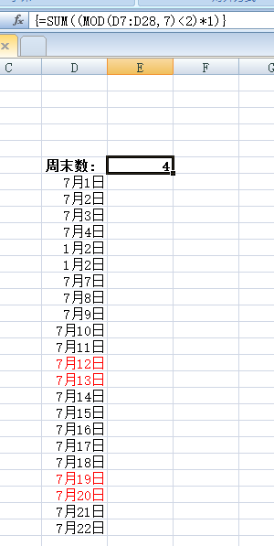
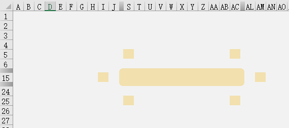
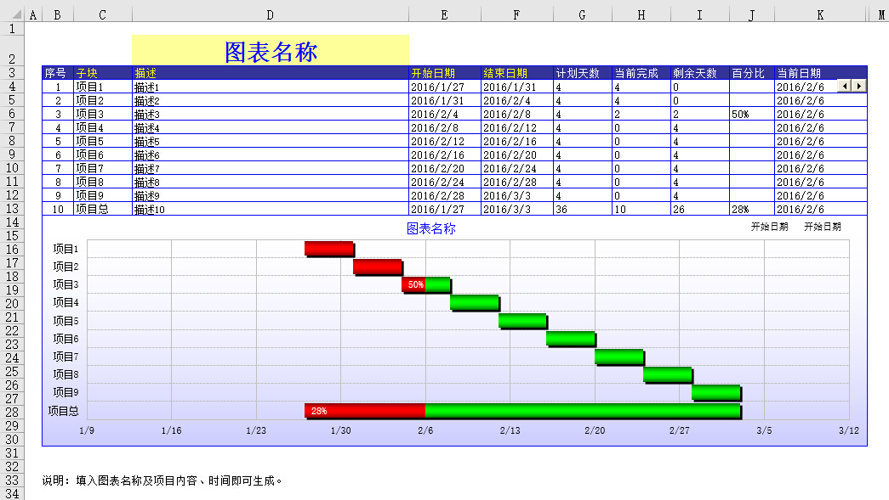
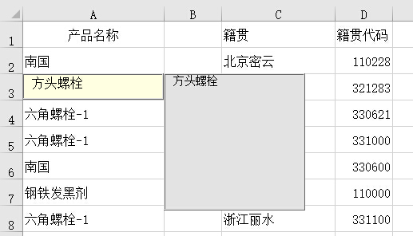
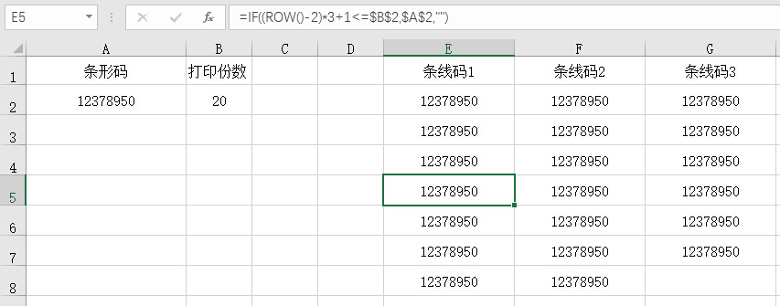

# 2.2 EXCEL应用汇

## 计算周末数量
    

## 玩转日期加减滚动

- Excel下载：  
地址[请右键另存](src/2.2.2.xlsx)

## EXCEL也能百度一下

- Excel下载：  
地址[请右键另存](src/2.2.3.xlsx)

##像素圆角(不用插入图形也能画圆角矩形)

- Excel下载：  
地址[请右键另存](src/2.2.4.xls)

## 甘特图生成器(项目进度管理)

- Excel下载：  
地址[请右键另存](src/2.2.5.xls)

## 输入时逐步提示信息(两个及以上)

- Excel下载：  
地址[请右键另存](src/2.2.6.xls)

## 函数打印条形码示例

- Excel下载：  
地址[请右键另存](src/2.2.7.xls)

## 单元格内容分列

> @张PM  
>   
> =TRIM(MID(SUBSTITUTE($A3,"，",REPT(" ",99)),COLUMN(A3)*99-98,99))

## links
  * [目录](<preface.md>)
  * 上一节: [上一节](<02.1.md>)
  * 下一节: [下一节](<02.3.md>)
