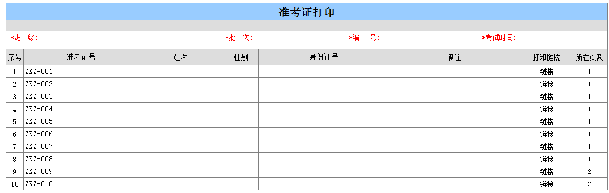
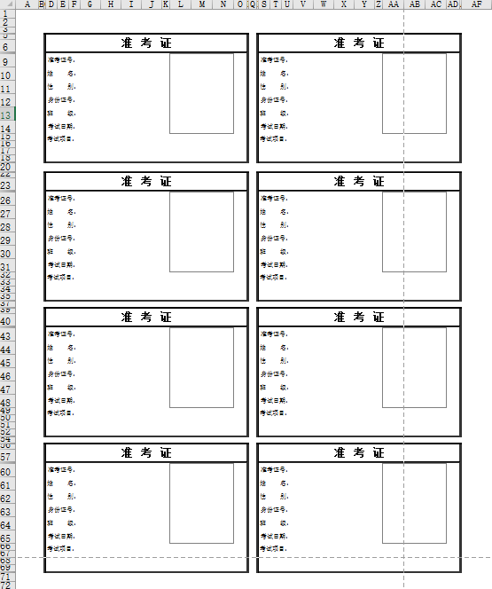

# 2.8 Excel批量打印准考证的一种方法
## 需求
* 批量选择考生，打印考生准考证

* 准考证8人打印一张A纸上

## 方法
* 两个模版A：准考证打印  B:准考证

* 所在页数公式：=IF(C7="","",INT(B7/8.1)+1)

* 先填报A，保存，A明细链接到B,传参数<唯一单号>、<所在页数>到B

* B用8个提数公式提取8个身份证号，条件1.序号=8*(所在页数-1)+1、条件2.序号=8*(所在页数-1)+2 ….条件8.序号=8*(所在页数-1)+8

## 下载
[下载Excel样表](src/2.8.xls)

## 本节贡献者
*@张PM*  

## links
  * [目录](<preface.md>)
  * 上一节: [上一节](<02.7.md>)
  * 下一节: [下一节](<03.0.md>)
