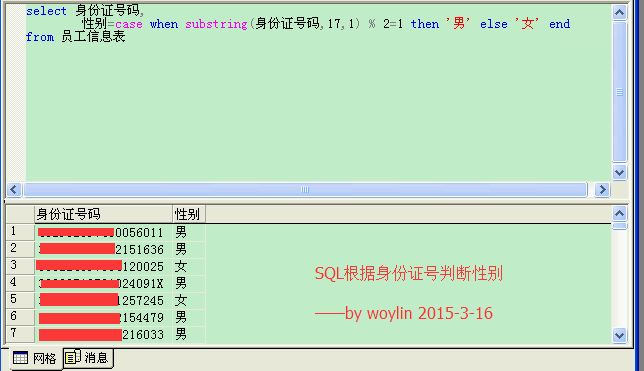

# 3.1 SQL应用汇

## 统计ES开发
据说高手的平均模板编辑次数不超过10次，你做到了吗？  
    
```sql
--统计模板更新
select rtid,
	rtno 编号编号,
	rtname 模板名称,
	classid,
	creuname 创建人,
	cretime 创建时间,
	updtime 更新时间,
	ver 
from es_tmp
order by ver desc
--统计总更新
select sum(ver) 总编辑次数,
	count(rtid) 模板数量,
	max(ver) 最高编辑次数,
	sum(ver)/count(rtid) 平均每个模板编辑次数 
from es_tmp
```
## SQL根据身份证判断性别


## 本节贡献者
*@挨踢熊*  

## links
  * [目录](<preface.md>)
  * 下一节: [下一节](<03.2.md>)
