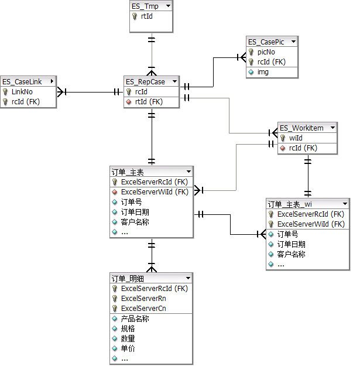

# 3.6 ExcelServerRcId等系统字段的含义  
用户自己定义的数据表创建之后，从SQL Server中看，会看到其中有若干以ExcelServer开头的字段名，如 ExcelServerRcId，ExcelServerWiId等等，这些字段是我们的程序在创建表的时刻自动增加进去的，它们存在的目的是为了让用户数据表能够和其它的系统数据表建立关系。  
下面的ER图表示了用户数据表和系统数据表之间的关系：  

 
## 主要系统表含义
* ES_tmp：模板。每个模板一条记录。主键是rtId，为模板号（是系统内部产生的号，不是用户通过界面输入的那个） 
* ES_RepCase：表单。每张被填报保存的单据或报表，产生一条记录。主键是rcId。 
* ES_workItem：工作流待办事项，主键为wiId。一个表单会流经多个步骤，每个步骤在 ES_workItem中都会存在一条记录，所以ES_RepCase和ES_workitem是1对多的关系。

## 系统表主要字段含义
* ES_RepCaes表
	* fillUser：填报人用户号，参考ES_User.userId 
	* fillUserName：填报人用户名，=(select userName from es_user where userId=fillUser字段的值) 
	* fillDept：填报人部门号，=(select deptId from es_user where userId=fillUser字段的值) 
	* fillDeptName：填报人部门名，=(select deptName from es_dept where deptId=fillDept字段的值) 
	* fillDate：填报时间，即第一次填报保存的时间。 
以上字段在第一次保存的时候产生，以后再修改也不会改变  
	* state：只有以下情况为0，此外都是1
模板带工作流，刚刚从别的模板工作流被转填过来，还没有办理  
	* lstFiller：最后修改人用户号 
	* lstFillerName：最后修改人用户名 
	* lstFillDate：最后修改时间 
	* rcDesc：表单摘要，看模板属性窗口中“报表摘要”标签页，根据那里的设置构造。
	 
## 用户数据表中的系统字段：
 * 对于模板上定义的（已创建的）数据表，其中有字段 ExcelServerRcId，和ES_RepCase.rcId对应
 * 对于主表，因为每张表单上只能有一条主表记录，故其ExcelServerRcId是唯一的；同一ExcelServerRcId会有多条记录。通过ExcelServerRcId字段能够识别明细表记录和主表记录之前的对应关系。
 * 事实上，ExcelServerRcId并不是主表中的主键，是唯一索引。为了强调数据表和ES_RepCase之间的关系，上图把它画成了主键。
 * 数据表中还有一个字段：ExcelServerWiId；对于不带工作流的模板，此字段内容始终为空白，对于带工作流的模板，此字段表示本表单的最后一个（被完成）步骤的wiId。在ES_workItem中能找到对应的记录。

## 工作流快照数据表：
 * 对于有工作流的模板，每个数据表都有一个相同结构的附属表，名为<表名>_wi
 * 如前面的图所示，订单模板上定义了两个数据表“订单_主表”和“订单_明细”，因订单模板上带工作流，所以同时还存在 “订单_主表_wi”及“订单_明细_wi”，它们的表结构和“订单_主表”及“订单_明细”完全相同。
 * “_wi”表的作用是存储工作流的快照。例如，假设某张订单已经流经了3个步骤，“订单_主表”中该订单（用ExcelServerRcId标识）只有一条记录，存储的是最近一次待办事宜提交后的订单信息，即订单的当前状态，而在“订单_主表_wi”中会有三条对应记录，它们的ExcelServerRcId都相同，但是ExcelServerWiId各不相同，分别记录三个步骤提交时刻的订单信息快照。

## 本节贡献者
*@清风*

## links
  * [目录](<preface.md>)
  * 上一节: [上一节](<03.5.md>)
  * 下一节: [下一节](<03.7.md>)
