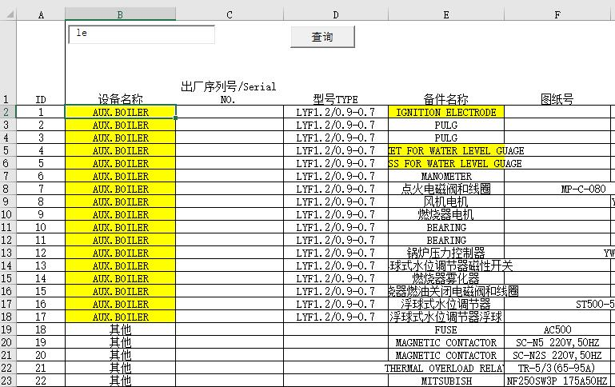
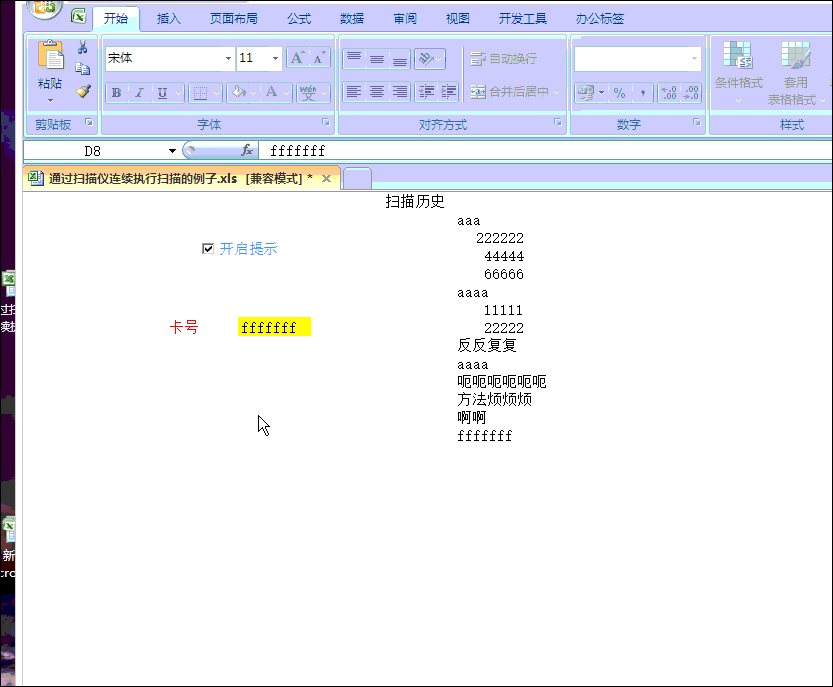

# 4.11 VBA应用汇
## NewReport接口如何添加多个数据明细字段


## 点击图片后隐藏图片本身


## 点击按钮打开特定超链接
> *@袖子*  


## 纯查询调用存储过程示例(VBA获取当前用户名)


## 动态调用树形或列表


## 解决条码、二维码控件连续打印不刷新的问题


## 记录模板打印次数


## 双击弹出对应报表的示例


## 双击切换单元格中的文字
将区域定义为`_data`  
  
```vb
Private Sub Worksheet_BeforeDoubleClick(ByVal Target As Range, Cancel As Boolean)
	Cancel = True
	If Intersect(Target, [_data]) Is Nothing Then Exit Sub
	If Target(1) = "Y" Then Target(1) = "N" Else Target(1) = "Y"
End Sub
```

## 关键字快速高亮定位
> *@荊喌*  
  
```vb
Private Sub CommandButton1_Click()
   AAAA = Empty
    Dim i%, j%, k%, rng As Range
    i = ThisWorkbook.Sheets("Sheet1").Cells(Rows.Count, 2).End(xlUp).Row
    Sheet1.Range("a1:g" & i).Interior.ColorIndex = xlNone
    For Each rng In Range("b2:g" & i)
        If InStr(UCase(rng), UCase(Sheet1.TextBox1)) Then
            rng.Interior.ColorIndex = 6
            If AAAA = Empty Then
            AAAA = rng.Address
            End If
        End If
    Next
   Range(AAAA).Activate
End Sub
```
- Excel下载：  
地址[请右键另存](src/4.11.11.xls)

## 数据透视表刷新
```vb
ActiveSheet.PivotTables("数据透视表1").PivotCache.Refresh
```

## 延时程序
```vb
'调用时，使用 delay 3  即可延时3秒
sub delay(T as single)
	dim T1 as single
	t1=timer
	do
		doevents
	loop while timer-t1<t
end sub
```

## 判断单元格是否属于某区域
```vb
'方法一
If Union(ActiveCell, Range("aa")).Address = Range("aa").Address Then
	MsgBox "包函"
Else
	MsgBox "不包函"
End If
'方法二
If Not Intersect(ActiveCell, Range("aa")) Is Nothing Then
	MsgBox "包函"
Else
	MsgBox "不包函"
End If
```

## 执行表间公式前先弹出确认对话框
> 挨踢熊
```vb
Sub 按钮1_Click()
Dim t
t = MsgBox("取数有风险，是否继续？", vbYesNo + vbQuestion, "挨踢熊")
If t = vbYes Then
    Dim oAdd As Object
    Set oAdd = Application.COMAddIns("ESClient10.Connect").Object
    oAdd.execquery ("查货品,查期初,查出入")
    Set oAdd = Nothing
End If
End Sub
```

## 一句话VBA(ES-VBA接口)
```vb
'-----------------------------------------------------
'VBA 简化代码 by woylin 2014-9-28
'-----------------------------------------------------
'★提数★
Private Sub btn1_Click()
	 Application.COMAddIns("esclient10.connect").Object.execquery "提数 1"
End Sub
'★回写★
Private Sub btn2_Click()
	 If Application.COMAddIns("esclient10.connect").Object.execupdate("回写 1") Then MsgBox "OK"
End Sub
'★新建★
Private Sub btn4_Click()
	 Application.COMAddIns("esclient10.connect").Object.newreport "入库单"
End Sub
'注意第二参数用于控制关闭调用源表单，官方教程中未指出
Private Sub btn5_Click()
	 Application.COMAddIns("esclient10.connect").Object.newreport "出库单", 1
End Sub
'★弹出规范★
Private Sub btn1p_Click()
	 [i6].Select: Application.COMAddIns("esclient10.connect").Object.poptree "名字_树"
End Sub
'注意该接口可调用列表规范，官方教程中未指出
Private Sub btn2p_Click()
	 [d6].Select: Application.COMAddIns("esclient10.connect").Object.poptree "批次库存_列表"
End Sub
'★插入行★
Private Sub btn9_Click()
	 Application.COMAddIns("esclient10.connect").Object.InsertRow 1, 6, 1
End Sub
'★保存★
Private Sub btnSave_Click()
	 Application.COMAddIns("esclient10.connect").Object.savecase , , 0
End Sub
'★存储过程★
Private Sub btn1n_Click()
	 Dim sErr$
	 If Application.COMAddIns("esclient10.connect").Object.ExecProc("p_2", sErr, "") Then MsgBox "已更新"
End Sub
'★存储过程(带结果集)★
Private Sub btn2n_Click()
	 Dim Rs As New ADODB.Recordset, sErr$
	 If Application.COMAddIns("esclient10.connect").Object.ExecQryProc("p_1", Rs, sErr, "") Then myGrid1.SetDatasource Rs
End Sub
```

## 通过扫描仪连续执行扫描的例子


- Excel下载：  
地址[请右键另存](src/4.11.xls)

## 从sql读取数据并显示的例子
直接用VBA从数据库取数，纯EXCEL也能做到，不过数据库连接参数会暴露在代码中，不如用ES存储过程接口安全

- Excel下载：  
地址[请右键另存](src/4.11.2.xls)

## 从sql读取图片数据流并显示的例子
如果ES不开启网盘，图片附件会以二进制方式存储在数据库中，与普通读取方式不同的是图片附件的读取为“流式”读取

- Excel下载：  
地址[请右键另存](src/4.11.1.xls)

## 纯查询必填检查示例
  
```vb
'按钮宏
Sub xSave()
If xCheck(Range("d7,d10:d12")) Then Exit Sub  'd7,d10:d12改成需要验证的单元格区域
'TODO: 这里是验证通过后的正常代码
MsgBox "验证通过！"
End Sub
'验证函数 by woylin 2015.3.21
Function xCheck(rng As Range) As Boolean
    Dim cel
    For Each cel In rng
        If cel.Value = "" Then
            MsgBox cel.Offset(0, -1) & "必填(" & cel.Address & ")"
            xCheck = True
            Exit Function
        End If
    Next
    xCheck = False
End Function
```

## 生成时间明细
    
```vb
Private Sub CommandButton1_Click()
	a = Range("A65536").End(xlUp).Row
	
	If CommandButton1.Caption = "生成" Then
		CommandButton1.BackColor = &HFF8080
		For h = 2 To 100
			'起始时间是9:12 增加量是2分27秒
			Cells(h, 1) = Evaluate("Time(9, 12 + 4*" & h - 2 & ", 27*" & h - 2 & ")")   
			Cells(h, 1).NumberFormatLocal = "h:mm;@"  '格式
		Next
		CommandButton1.Caption = "清除"
		CommandButton1.BackColor = &HFF&
	Else
		Range("A2:A" & a).Clear
		CommandButton1.Caption = "生成"
		CommandButton1.BackColor = &HFF8080
	End If
End Sub
```

## 表内自定义公式
    
```vb
'thisworkbook中的代码
Private Sub Worksheet_Change(ByVal Target As Range)
    Cells.Calculate
End Sub
'插入一个模块，填入下面函数代码
Function xEval(rng As Range, rngs As Range)
    '第一个参数是公式字符串，第二个是参数表
    Dim tmp$
    tmp = rng.Value
    '遍历参数表进行替换
    For i = 1 To rngs.Count
        tmp = Replace(tmp, "{" & i & "}", CSng(rngs.Item(i).Value))
    Next
    'TODO： 这个函数类似C语言的printf,使用{1}，{2}。。。这样的文本格式定义公式
    xEval = Application.Evaluate("=" & tmp)
End Function
```

## 直接叫出工作台   
```vb
'2007版无效，适用于03和10版
Sub xxx()
     Application.CommandBars("Worksheet Menu Bar").Controls("报表(&R)").Controls(1).Execute
End Sub
```

## 当前sheet另存到本地示例   
```vb
Sub xSave()
    Dim n%, a%
    Dim wb, wb2 As Workbook
    Dim i%
    Application.ScreenUpdating = False
    Set wb = ThisWorkbook.ActiveSheet
    Set wb2 = Workbooks.Add
    ActiveWindow.DisplayGridlines = False
'    For i = 1 To wb.Sheets.Count
        wb.Cells.Copy wb2.Sheets(1).Cells
'    Next
'    wb2.Sheets(1).Shapes("XSAVES").Delete
	'**********以下代码调整格式用，请忽略*************'
    With wb2.Sheets(1)
        n = 8
        i = 1
        Do
            .Cells(n, 1) = i
'            .Cells(n, 1).RowHeight = 14.25
            .Cells(n + 1, 1).EntireRow.Insert
            .Cells(n + 1, 2) = "    订单特殊要求：" & .Cells(n, 9).Value
            .Cells(n, 9) = ""
            With .Range("B" & n + 1 & ":G" & n + 1)
                .Merge
                .Validation.Delete
                .HorizontalAlignment = xlGeneral
                a = Application.Max(Len(.Item(1).Value) / 40, Len(.Item(1).Value) - Len(Application.Substitute(.Item(1).Value, VBA.Chr(10), "")) + 1)  '25根据实际情况自己调整
                Rows(.Row).RowHeight = 14.25 * (a + 1)
            End With
            n = n + 2
            i = i + 1
        Loop While (.Cells(n, 1).Value <> "交货条件")
        .PageSetup.PrintArea = "$A:$G"
    End With
	'**********以上代码调整格式用，请忽略*************'
    Application.ScreenUpdating = True
    Set wb = Nothing
    Set wb2 = Nothing
End Sub
```

## links
  * [目录](<preface.md>)
  * 上一节: [上一节](<04.10.md>)
  * 下一节: [下一节](<04.12.md>)
