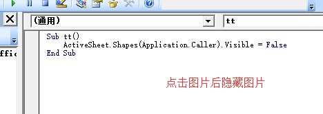
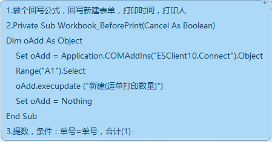
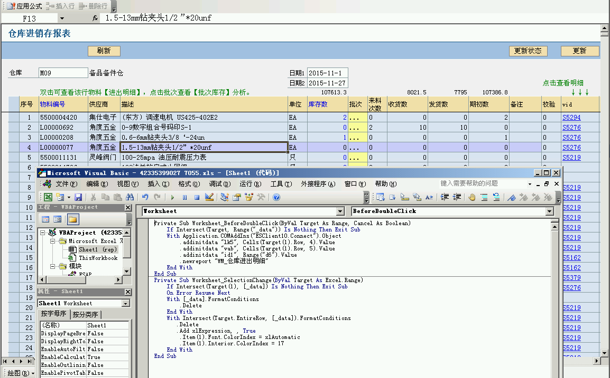
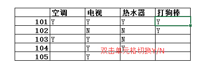
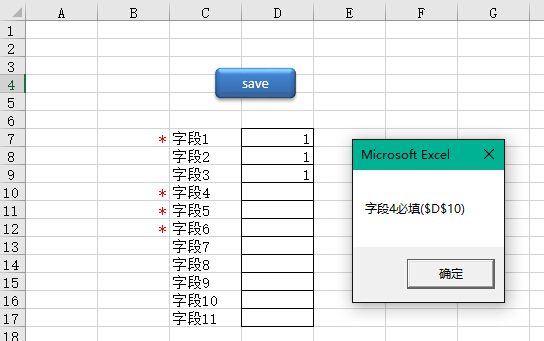

# 4.15 VBA应用汇
## newreport接口如何添加多个数据明细字段


## 点击图片后隐藏图片本身


## 记录模板打印次数


## 双击弹出对应报表的示例


## 双击切换单元格中的文字
将区域定义为`_data`  
  
```vb
Private Sub Worksheet_BeforeDoubleClick(ByVal Target As Range, Cancel As Boolean)
	Cancel = True
	If Intersect(Target, [_data]) Is Nothing Then Exit Sub
	If Target(1) = "Y" Then Target(1) = "N" Else Target(1) = "Y"
End Sub
```

## 获取打印页数
只能用VBA解决，下面的代码由 `cbtaja` 录制，将下面代码粘贴进 工具--宏--VB编辑器后，以下公式可用：
- =ThisPageNo 显示当前页数，
- =PagesCount 显示总页数；
- =TEXT(ThisPageNo,"第0页 ")&TEXT(PagesCount,"共0页") 在同一单元格显示当前页数和总页数  
```vb
Sub 定义页码及总页数名称()
    ActiveWorkbook.Names.Add Name:="ColFirst", RefersToR1C1:= _
        "=GET.DOCUMENT(61)" '判断打印顺序的设置类型
    ActiveWorkbook.Names.Add Name:="lstRow", RefersToR1C1:= _
        "=GET.DOCUMENT(10)" '本工作表已用到的最大行数
    ActiveWorkbook.Names.Add Name:="lstColumn", RefersToR1C1:= _
        "=GET.DOCUMENT(12)" '本工作表已用到的最大列数
    ActiveWorkbook.Names.Add Name:="hNum", RefersToR1C1:= _
        "=IF(ISERROR(FREQUENCY(GET.DOCUMENT(64),Row())),0,FREQUENCY(GET.DOCUMENT(64),Row()))" 'hNum为本单元格上方的水平分页符个数
    ActiveWorkbook.Names.Add Name:="vNum", RefersToR1C1:= _
                "=IF(ISERROR(FREQUENCY(GET.DOCUMENT(65),Column())),0,FREQUENCY(GET.DOCUMENT(65),Column()))" ''本单元格左边的垂直分页个数
    ActiveWorkbook.Names.Add Name:="hSum", RefersToR1C1:= _
        "=IF(ISERROR(FREQUENCY(GET.DOCUMENT(64),lstRow)),0,FREQUENCY(GET.DOCUMENT(64),lstRow))" ''本工作表最后一个单元格上方的水平分页符个数
    ActiveWorkbook.Names.Add Name:="vSum", RefersToR1C1:= _
                "=IF(ISERROR(FREQUENCY(GET.DOCUMENT(65),lstColumn)),0,FREQUENCY(GET.DOCUMENT(65),lstColumn))" ''本工作表最后一个单元格左边的垂直分页个数
    ActiveWorkbook.Names.Add Name:="ThisPageNo", RefersToR1C1:= _
        "=IF(ColFirst,(hSum+1)*vNum+hNum+1,(vSum+1)*hNum+vNum+1)*ISNUMBER(NOW())" '单元格所在页码
    ActiveWorkbook.Names.Add Name:="PagesCount", RefersToR1C1:= _
        "=GET.DOCUMENT(50)*ISNUMBER(NOW())" '本工作表的总页数
End Sub
```

## 纯查询必填检查示例
  
```vb
'按钮宏
Sub xSave()
If xCheck(Range("d7,d10:d12")) Then Exit Sub  'd7,d10:d12改成需要验证的单元格区域
'TODO: 这里是验证通过后的正常代码
MsgBox "验证通过！"
End Sub
'验证函数 by woylin 2015.3.21
Function xCheck(rng As Range) As Boolean
    Dim cel
    For Each cel In rng
        If cel.Value = "" Then
            MsgBox cel.Offset(0, -1) & "必填(" & cel.Address & ")"
            xCheck = True
            Exit Function
        End If
    Next
    xCheck = False
End Function
```

## 生成时间明细
    
```vb
Private Sub CommandButton1_Click()
	a = Range("A65536").End(xlUp).Row
	
	If CommandButton1.Caption = "生成" Then
		CommandButton1.BackColor = &HFF8080
		For h = 2 To 100
			'起始时间是9:12 增加量是2分27秒
			Cells(h, 1) = Evaluate("Time(9, 12 + 4*" & h - 2 & ", 27*" & h - 2 & ")")   
			Cells(h, 1).NumberFormatLocal = "h:mm;@"  '格式
		Next
		CommandButton1.Caption = "清除"
		CommandButton1.BackColor = &HFF&
	Else
		Range("A2:A" & a).Clear
		CommandButton1.Caption = "生成"
		CommandButton1.BackColor = &HFF8080
	End If
End Sub
```
## 表内自定义公式
    
```vb
'thisworkbook中的代码
Private Sub Worksheet_Change(ByVal Target As Range)
    Cells.Calculate
End Sub
'插入一个模块，填入下面函数代码
Function xEval(rng As Range, rngs As Range)
    '第一个参数是公式字符串，第二个是参数表
    Dim tmp$
    tmp = rng.Value
    '遍历参数表进行替换
    For i = 1 To rngs.Count
        tmp = Replace(tmp, "{" & i & "}", CSng(rngs.Item(i).Value))
    Next
    'TODO： 这个函数类似C语言的printf,使用{1}，{2}。。。这样的文本格式定义公式
    xEval = Application.Evaluate("=" & tmp)
End Function
```
## 超链接跳转填报及返回刷新示例
    
```vb
'thisworkbook中的代码
Private Sub Worksheet_Change(ByVal Target As Range)
    Cells.Calculate
End Sub
'插入一个模块，填入下面函数代码
Function xEval(rng As Range, rngs As Range)
    '第一个参数是公式字符串，第二个是参数表
    Dim tmp$
    tmp = rng.Value
    '遍历参数表进行替换
    For i = 1 To rngs.Count
        tmp = Replace(tmp, "{" & i & "}", CSng(rngs.Item(i).Value))
    Next
    'TODO： 这个函数类似C语言的printf,使用{1}，{2}。。。这样的文本格式定义公式
    xEval = Application.Evaluate("=" & tmp)
End Function
```


## links
  * [目录](<preface.md>)
  * 上一节: [上一节](<04.14.md>)
  * 下一节: [下一节](<04.16.md>)
