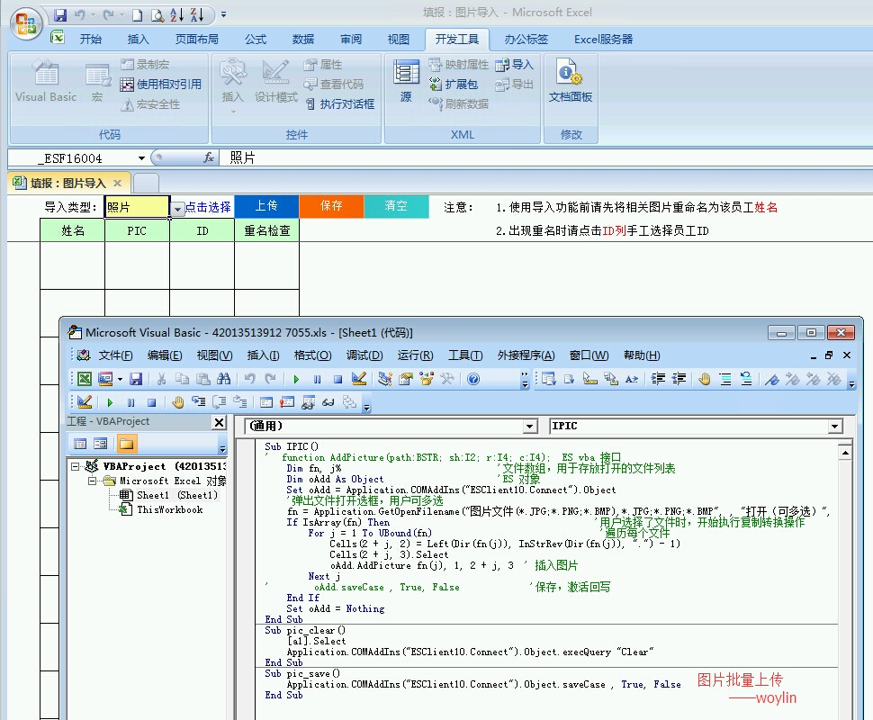

# 4.5 VBA的图片接口怎么用？怎么实现点哪儿插哪儿
*注意： 9.4以上才有图片插入VBA接口*

```vb
Sub pic_insert()
	Dim fn
	fn = Application.GetOpenFilename()
	Application.COMAddIns("ESClient10.Connect").Object.AddPicture fn, 1, ActiveCell.Row, ActiveCell.Column
End Sub
```

## 定点插入示例（R5C7）
```vb
Sub IPIC()
'  function AddPicture(path:BSTR; sh:I2; r:I4; c:I4);  ES vba 接口
    Dim fn                         '存放打开的文件
    '弹出文件打开选框
    fn = Application.GetOpenFilename("图片文件(*.JPG;*.PNG;*.BMP),*.JPG;*.PNG;*.BMP", , "打开（可多选）")
    If fn = "" Then Exit Sub                                     '用户未选择文件
    Cells(5, 7).Select
    Application.COMAddIns("ESClient10.Connect").Object.AddPicture fn, 1, 5, 7 ' 插入图片
End Sub
```

## 批量上传示例


## 本节贡献者
*@Castle*
 
## links
  * [目录](<preface.md>)
  * 上一节: [上一节](<04.4.md>)
  * 下一节: [下一节](<04.6.md>)
