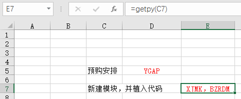
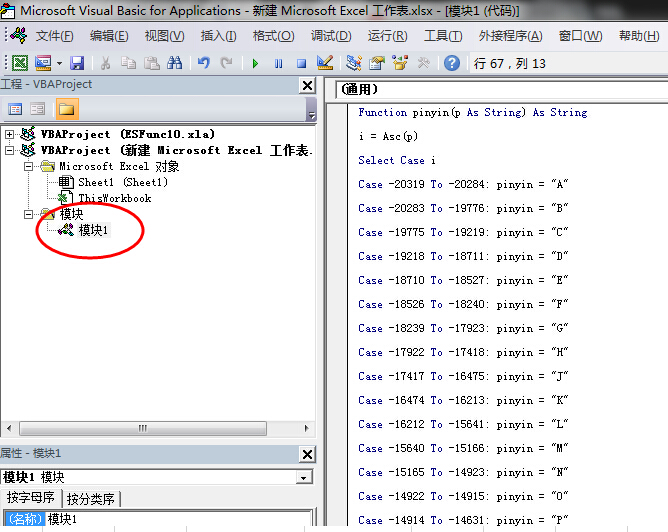

# 4.9 汉字转首字母
	ES自带的拼音函数经常失灵，自己做的模块最放心
  



### 代码方案一  
```vb
Function pinyin(p As String) As String
 
	i = Asc(p)
	 
	Select Case i
	 
	Case -20319 To -20284: pinyin = "A" 
	
	Case -20283 To -19776: pinyin = "B" 
	
	Case -19775 To -19219: pinyin = "C" 
	
	Case -19218 To -18711: pinyin = "D"
	 
	Case -18710 To -18527: pinyin = "E"
	 
	Case -18526 To -18240: pinyin = "F"
	 
	Case -18239 To -17923: pinyin = "G"
	 
	Case -17922 To -17418: pinyin = "H"
	 
	Case -17417 To -16475: pinyin = "J"
	 
	Case -16474 To -16213: pinyin = "K"
	 
	Case -16212 To -15641: pinyin = "L"
	 
	Case -15640 To -15166: pinyin = "M"
	 
	Case -15165 To -14923: pinyin = "N"
	 
	Case -14922 To -14915: pinyin = "O"
	 
	Case -14914 To -14631: pinyin = "P"
	 
	Case -14630 To -14150: pinyin = "Q"
	 
	Case -14149 To -14091: pinyin = "R"
	 
	Case -14090 To -13319: pinyin = "S"
	 
	Case -13318 To -12839: pinyin = "T"
	 
	Case -12838 To -12557: pinyin = "W"
	 
	Case -12556 To -11848: pinyin = "X"
	 
	Case -11847 To -11056: pinyin = "Y"
	 
	Case -11055 To -2050: pinyin = "Z"
	 
	Case Else: pinyin = p
	 
	End Select
 
End Function
 
Function getpy(str)
	 
	For i = 1 To Len(str)
	 
		getpy = getpy & pinyin(Mid(str, i, 1))
	 
	Next i
 
End Function
```

### 代码方案二
```vb
Function getpy(x)
	On Error Resume Next
	Application.Volatile
	For i = 1 To Len(x)
	PY = PY & Application.WorksheetFunction.HLookup(Mid(x, i, 1), [{"吖","八","嚓","咑","鵽","发","猤","铪","夻","咔","垃","呒","旀","噢","妑","七","囕","仨","他","屲","夕","丫","帀";"A","B","C","D","E","F","G","H","J","K","L","M","N","O","P","Q","R","S","T","W","X","Y","Z"}], 2)
	Next
End Function
```

## 本节贡献者
*@木头*   
*@研特* 

## links
  * [目录](<preface.md>)
  * 上一节: [上一节](<04.8.md>)
  * 下一节: [下一节](<04.10.md>)
