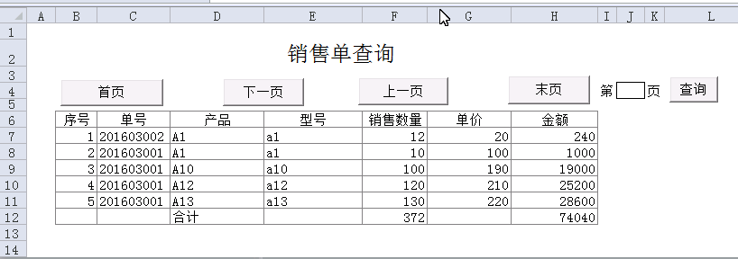
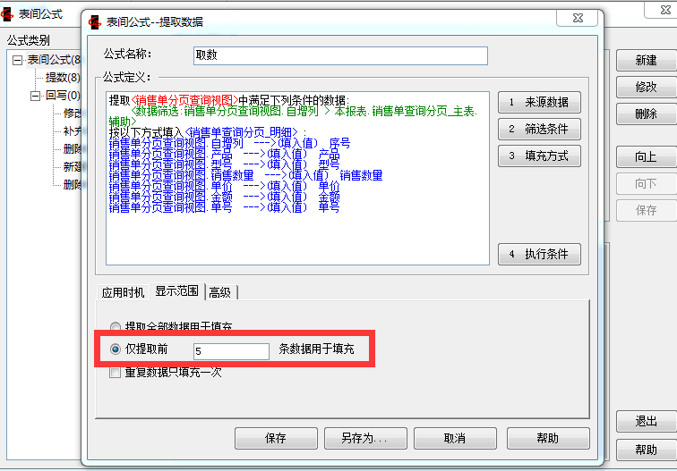
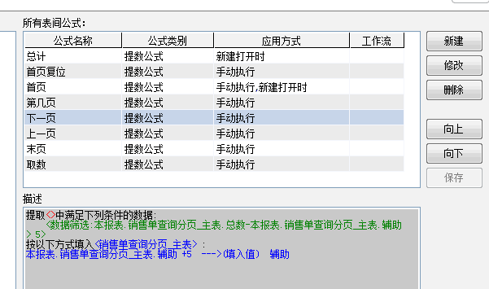
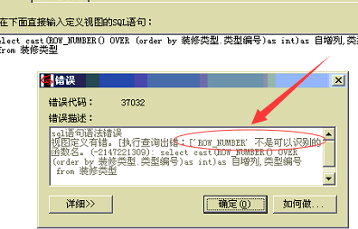

# 5.9 实现模板分页
需求：实现ES模板分页技术。



## 实现步骤
### 1. 新建数据视图，应用sql函数ROW_NUMBER()实现id连号；

```sql
SELECT  cast(ROW_NUMBER() OVER (ORDER BY dbo.销售单_明细.产品) as int) AS 自增列, 
	产品, 型号, 销售数量, 单价, 金额, 单号
FROM  dbo.销售单_明细
```

### 2. 应用提数公式的仅提取前5条，实现限制显示查询；



### 3. 通过VBA按钮对起始id进行筛选。



4. [模板下载](files/5.9.rar)

## 注意
ROW_NUMBER()函数需要sqlserver 2005及以上版本才能支持，否则出现下列错误。



## 本节贡献者
*@昆明haotian*

## links
  * [目录](<preface.md>)
  * 上一节: [上一节](<05.8.md>)
  * 下一节: [下一节](<05.10.md>)
